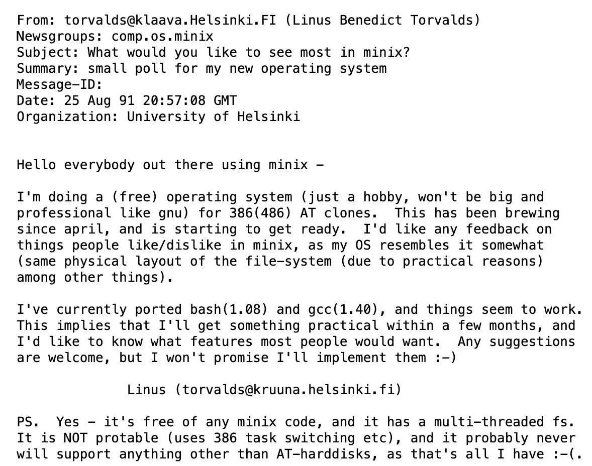

# Produire un texte en markdown

Le markdown est un langage à balise simplifié permettant de créer du contenu qui sera affiché sur des sites web supportant ce langage comme Github ou Gitlab.

De nombreux sites proposent des tutoriels. Je vous invite à les consulter, en particulier .

Par exemple, les titres sont identifiés par le signe \# :

- Titre de niveau 1 : `# Titre 1`
- Titre de niveau 2 : `## Titre 2`
- Titre de niveau 3 : `### Titre 3`

Pour faire un lien vers une page web, on utilise la syntaxe suivante : `[texte descriptif](url de la page)`. Cette syntaxe correspond à la balise html suivante : `<a href='url de la page'>Texte descriptif</a>`.

Pour inclure une figure, deux solutions :

- afficher une image trouvée sur le web à partir de son url : ``

- afficher une image enregistrée sur son ordinateur : `` par exemple ``

Pour les notes de bas de page, on fait `[^1]`puis en bas du documment, on ecrit `[^1]: ceci est une note de bas de page`. [^1]

Toutefois, il est parfois nécessaire d'utiliser du code HTML pour certains fonctions plus avancées. Par exemple, si on veut inclure une vidéo youtube ou un podcast, on peut utiliser la balise `<iframe></iframe>`. Exemple :

`<iframe width="100%" src="https://audioblog.arteradio.com/embed/98898" style="margin: 0;padding: 0;border: none;"></iframe>`

<iframe width="100%" src="https://audioblog.arteradio.com/embed/98898" style="margin: 0;padding: 0;border: none;"></iframe>

## À vous de jouer

Créer une page en markdown comportant les éléments suivants :

- Un titre de niveau 1 et un titre de niveau 2. Le titre de votre exploration et le titre d'une partie par exemple

- Un "bloc de citations" (blockquote). Vous pouvez prendre une citation tirée de vos articles

- Une image illustrant votre sujet (attention aux droits d'auteurs)

- Un podcast ou une vidéo en lien également avec votre sujet.

- Une note de bas page indiquant une référence bibliographique

[^1]: Ceci est une note de bas de page.

